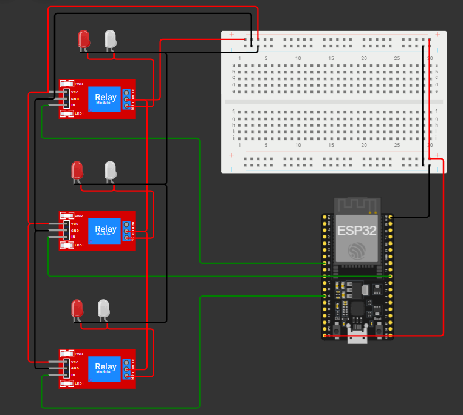
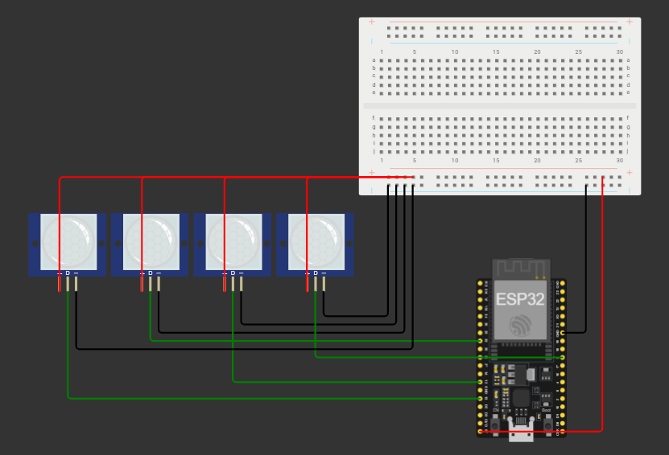

# ⚡ PowerNest – Smart Energy Optimization System

> A full-stack IoT platform for automating and optimizing energy usage using ESP32 devices, real-time communication, and intelligent control systems.


---

## 🌐 Live Demo

- **Frontend:** https://powernest-self.vercel.app  
- **Backend:** https://powernest-backend-ftk0.onrender.com  
- **ESP Server:** https://powernest-espserver.onrender.com  

### 🔬 Wokwi Simulations

- **Relay Control Simulation (Room Automation):** https://wokwi.com/projects/457683788654445569  
- **PIR Sensor Simulation (Motion Detection):** https://wokwi.com/projects/451049763231093761 

---

## 🚀 What is PowerNest?

PowerNest is a smart energy management system designed for campuses, hostels, and smart buildings.

- ⚡ Automatic device control using PIR sensors  
- 🎛️ Manual device control via web interface  
- 📡 Real-time communication using MQTT + WebSockets  
- 🏢 Block & room-based management  

---

## 🧠 Features

- Smart relay control via ESP32  
- Auto + Manual modes  
- MQTT communication  
- Socket.IO real-time updates  
- OTP + Google authentication  
- Redis caching  

---

## 🏗️ System Architecture

Frontend (Next.js) → Backend (Express + MongoDB + Redis) → ESP Server (MQTT) → ESP32 Devices

---

## 🔌 Hardware Diagrams

### Relay Circuit


### PIR Circuit


---

## 🧰 Tech Stack

| Layer | Technology |
|------|-----------|
| Frontend | Next.js + Tailwind CSS |
| Backend | Node.js + Express.js |
| Database | MongoDB Atlas |
| Cache | Redis |
| Realtime | Socket.IO |
| IoT Protocol | MQTT |
| Hardware | ESP32 + PIR + Relay |

---

## 📁 Project Structure

```
POWERNEST/
│
├── backend/                          # API, authentication & real-time system
│   ├── config/                       # App configurations
│   │   ├── brevo.config.js           # Sends OTP & notification emails
│   │   └── redis.js                  # Handles caching & sessions
│   │
│   ├── controllers/                  # Controls and Communication logic
│   │   ├── block.controller.js       # Controls devices (ON/OFF)
│   │   ├── esp.controller.js         # Handles ESP data
│   │   ├── espServer.controller.js   # Communicates with ESP server
│   │   └── user.controller.js        # User authentication & management
│   │
│   ├── jwt/                          # Authentication tokens
│   │   └── generateToken.js          # Creates JWT tokens
│   │
│   ├── middleware/                   # Security & validation
│   │   ├── secureRoute.js            # Protects private routes
│   │   ├── validateOTP.js            # Verifies OTP
│   │   └── verifyGoogleToken.js      # Google authentication
│   │
│   ├── models/                       # Database schemas
│   │   ├── block.model.js            # Stores device/block data
│   │   ├── espData.model.js          # Stores sensor data
│   │   ├── otp.model.js              # Stores OTP data
│   │   └── user.model.js             # Stores user info
│   │
│   ├── routes/                       # API endpoints
│   │   ├── block.route.js            # Device control routes
│   │   ├── esp.route.js              # Sensor & device routes
│   │   ├── espServer.route.js        # ESP communication routes
│   │   └── user.route.js             # Authentication routes
│   │
│   ├── SocketIO/                     # Real-time communication
│   │   └── server.js                 # WebSocket server
│   │
│   └── index.js                      # Backend entry point
│
├── espServer/                        # MQTT IoT communication layer
│   ├── config/
│   │   └── mqtt.config.js            # MQTT broker configuration
│   │
│   ├── mqtt/
│   │   ├── handlers/                 # Motion detection events
│   │   └── mqttClient.js             # MQTT connection manager
│   │
│   ├── services/
│   │   ├── relay.service.js          # Controls devices via MQTT
│   │   └── roomMapping.service.js    # Maps devices to rooms
│   │
│   └── index.js                      # ESP server entry point
│
├── frontend/                         # User interface (Next.js)
│   ├── app/                          # Routing layer
│   ├── components/                   # UI components
│   ├── context/                      # Global state
│   ├── lib/                          # Util files
│   ├── public/                       # Public store
│   ├── store/                        # State management
│   ├── environment.js                # Sets the API server URL
│   └── package.json                  # project dependencies
│
├── wokwiSimulatorRooms/              # Room automation simulation
│   └── src/
│       └── roomCode.ino              # Controls devices via ESP
│
├── wokwiSimulatorSensors/            # Sensor simulation
│   └── src/
│       └── sensorCode.ino            # Sends sensor data
│
└── README.md                         # Project documentation
```

---

## ⚙️ Getting Started

### Prerequisites

- Node.js (v18+)
- MongoDB Atlas
- Redis
- MQTT Broker

---

### Installation

```bash
git clone https://github.com/AyushMishra-2005/PowerNest.git
cd powernest
```

### Backend

```bash
cd backend
npm install
npm run dev
```

### ESP Server

```bash
cd espServer
npm install
node index.js
```

### Frontend

```bash
cd frontend
npm install
npm run dev
```

---

## 📡 API Documentation

### 👤 User APIs

| Method | Endpoint | Description |
|--------|---------|------------|
| POST | /user/signup | Register |
| POST | /user/login | Login |
| POST | /user/logout | Logout |
| POST | /user/sendOTP | Send OTP |
| POST | /user/verifyOTP | Verify OTP |

---

### 🏢 Block APIs

| Method | Endpoint | Description |
|--------|---------|------------|
| POST | /block/add-block | Create block |
| GET  | /block/get-blocks | Get blocks |

---

### ⚡ ESP APIs

| Method | Endpoint | Description |
|--------|---------|------------|
| POST | /esp/add-pin | Add device |
| GET  | /esp/get-esp-data | Fetch data |
| POST | /esp/remove-connection | Remove device |
| POST | /esp/block-connection | Block device |
| GET  | /esp/get-room-data | Usage data |
| POST | /esp/toggle-connection | Toggle device |
| POST | /esp/power-off | Turn off room |

---

### 🧠 ESP Server APIs

| Method | Endpoint | Description |
|--------|---------|------------|
| GET  | /main-server/get-roomId | Map sensor to room |
| GET  | /main-server/get-active-pins | Update active pins |

---

## 📡 MQTT Topics

| Topic | Description |
|------|------------|
| powernest/status/{espId} | Device status |
| powernest/{espId}/pir/{pin} | Motion detection |
| powernest/{espId}/relay/{pin} | Relay control |

---

## 👨‍💻 Author

Ayush Mishra
